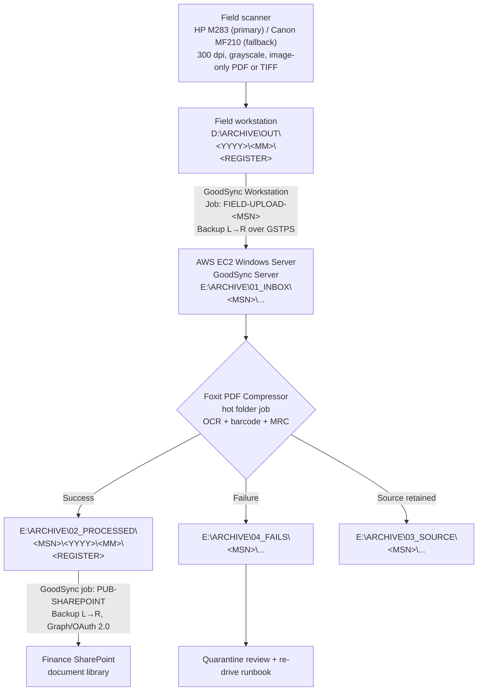

# Field Accounting Digitalization — GoodSync / Foxit / SharePoint
## Configuration and Operations Manual

| | |
|---|---|
| **Document** | Scan-to-Archive Pipeline — Configuration & Operations Manual |
| **Version** | 0.9 (draft for technical review) |
| **Owner** | Systems Architect, MSF WaCA |
| **Scope** | Field client workstations → central GoodSync Server (AWS) → Foxit PDF Compressor → Finance SharePoint |
| **Source baseline** | *OCA Field Accounting Digitilization* (June 2025) — architecture re-platformed from Synology NAS + on-prem Luratech to AWS EC2 + Foxit PDF Compressor |
| **Status** | Sections marked **[CONFIRM]** must be validated against the live consoles before go-live |

---

## 1. Purpose and scope

This manual describes how to build, configure and operate the field-accounting scan-to-archive pipeline:

1. A **field workstation** scans authorised accounting vouchers carrying an Avery L7651 barcode label.
2. **GoodSync Workstation** on that machine replicates the scans to the **central GoodSync Server** hosted on AWS.
3. On arrival, **Foxit PDF Compressor** picks the files up from a hot folder, applies **MRC compression + OCR + barcode recognition**, splits documents on barcode boundaries and renames them.
4. A second **GoodSync job on the server** publishes only the successfully converted PDFs to the **Finance SharePoint** document library, in the agreed name format.
5. Failures are quarantined, reported and re-driven through a documented runbook.

Out of scope: scanner procurement, barcode label generation, UniField booking procedures, SharePoint information architecture and retention policy.

---

## 2. Architecture overview



**Design principles applied**

| Principle | Implementation |
|---|---|
| Single direction of truth | Every transfer is one-way **Backup**, never two-way Sync. A deletion in SharePoint or on the server can never propagate back to a field machine. |
| Idempotent, resumable stages | Each stage has its own folder and its own job. Any stage can be stopped and restarted without data loss. |
| Fail loud, fail into a bucket | Nothing is deleted on failure. Failures land in `04_FAILS` and raise an email alert. |
| Field bandwidth is the scarcest resource | Compression and OCR run centrally, never in the field. The field only ships raw scans, on a throttled link. |
| Licence consumption is a controlled cost | Foxit is page-metered. Hot folders are configured so a file can never be reprocessed in a loop (see §6.7). |

---

## 3. Prerequisites, editions and licensing

### 3.1 Software editions

| Tier | Product | Notes |
|---|---|---|
| Field client | **GoodSync for Windows — Workstation** | One licence per workstation. The free/Personal tier is not licensed for unattended business use and is limited (jobs and file counts), so it must not be used for production missions. Budget one Workstation licence per scanning PC. |
| Central server | **GoodSync for Server (Windows Server)** | One licence per server. Runs as a background service, accepts inbound GSTP connections. |
| Fleet management (optional) | **GoodSync Control Center** | Web console that pushes jobs to "runners" (Workstation and Server installs) and reports run status centrally. GoodSync's own guidance is that individually managed installs are workable up to ~10 endpoints, and Control Center is intended for 10 or more. With 8+ WaCA missions plus growth, plan for Control Center. |
| Conversion engine | **Foxit PDF Compressor** (formerly Luratech) | Windows service + GUI. Licensed by page volume and/or CPU core. OCR is provided by the embedded ABBYY FineReader engine; the ABBYY licensing service must be running. |

### 3.2 Central server sizing (AWS)

| Item | Recommendation |
|---|---|
| Instance | Windows Server 2022, compute-optimised or general purpose, sized to the number of **licensed Foxit CPU cores** — do not license more cores than the instance provides, and do not size cores beyond the licence. |
| RAM | Minimum 1 GB per licensed core; 2 GB per core recommended; more for very large documents on 64-bit. |
| Data volume | Dedicated EBS **gp3** volume mounted as `E:` for `\ARCHIVE`. Per the WaCA EBS cost-management policy, gp3 is the default class; provision IOPS only against measured CloudWatch demand, not by assumption. |
| Prerequisites | .NET Framework 4.x; ABBYY SDK licensing service enabled; sufficient free space in the service account's TEMP for `LT_PDF_Compressor` working files (or redirect it with the `LT_PDFCOMP_TMP` environment variable). |

### 3.3 Accounts

| Account | Purpose | Requirements |
|---|---|---|
| `svc-pdfcompressor` | Runs the PDF Compressor Windows service | Local or domain account with read/write on all `E:\ARCHIVE` subfolders. The service runs in Session 0 and has **no knowledge of mapped drives** — always use `\\host\share\dir` UNC or local paths. |
| `svc-goodsync` | Runs the GoodSync Server service | Read/write on `E:\ARCHIVE`. |
| M365 service identity | GoodSync → SharePoint publishing | A licensed M365 account with write access to the target library. GoodSync authenticates to OneDrive/Office 365/SharePoint through the Microsoft Graph API using browser-based OAuth 2.0; the tenant administrator may need to approve the permission prompt. **[CONFIRM]** with the M365 admin before build day. |

---

## 4. Folder contract

The folder tree **is** the interface between the three products. Do not improvise it on any single machine.

### 4.1 Field workstation

```
D:\ARCHIVE\
├── OUT\                      <- GoodSync source. Finance drops scans here.
│   └── <YYYY>\<MM>\<REGISTER>\
├── SENT\                     <- optional local evidence copy (see §5.5)
└── _README.txt               <- one-page field quick reference (§10)
```

`<REGISTER>` values follow the existing finance register list, plus the two special folders carried over from the OCA model: **HR** and **ODM**. **[CONFIRM]** the authoritative register list with Finance.

### 4.2 Central server (`E:\ARCHIVE`)

| Folder | Written by | Read by | Retention |
|---|---|---|---|
| `01_INBOX\<MSN>\<YYYY>\<MM>\<REGISTER>\` | GoodSync Server (from field) | Foxit hot folder job | Emptied by Foxit post-processing |
| `02_PROCESSED\<MSN>\<YYYY>\<MM>\<REGISTER>\` | Foxit (output) | GoodSync SharePoint job | 30 days, then purge |
| `03_SOURCE\<MSN>\...` | Foxit (input file, on success) | Audit / re-drive | 90 days, then purge **[CONFIRM]** with Finance/audit |
| `04_FAILS\<MSN>\...` | Foxit (input file, on failure) | Operator | Until cleared — must trend to zero |
| `05_LOGS\` | Both products, scripts | Ops / monitoring | 12 months |

### 4.3 Mission codes (`<MSN>`)

Three-letter codes, one per operational mission. Working set for WaCA — **[CONFIRM]** against the official mission list before creating folders, because the code becomes part of every file name and is expensive to change later:

`NGA` Nigeria · `NER` Niger · `LBR` Liberia · `COD` DRC · `MRT` Mauritania–Senegal · `TCD` Chad · `CIV` Côte d'Ivoire · `HQ` Head office

---

## 5. Part A — Field client configuration (GoodSync Workstation)

### 5.1 Scanning settings (input contract)

Carried forward from the existing WaCA finance archiving SOP:

- **HP M283** primary device, **Canon MF210** fallback.
- **300 dpi**, grayscale, A4, auto-feeder.
- Barcode labels: **Avery L7651** only. Wrong sticker format, wrong barcode position on the page, and poor print quality are the three recurring causes of downstream failure.
- Wrong bookings: insert a **blank page carrying the barcode** to separate the document.
- Scan **at least monthly**.

> **Architectural note — do not scan to "searchable PDF".**
> Let the scanner produce an **image-only PDF or TIFF**. OCR is performed centrally by Foxit. If the scanner writes its own text layer, either Foxit's *Skip OCR if page contains text already* suppresses the good OCR, or you pay twice for recognition and get two conflicting text layers. One OCR engine, one place. This is a change from the current scanner profile and must be pushed to every device. **[CONFIRM]** and re-profile the devices.

### 5.2 Install and enrol the client

1. Install GoodSync for Windows on the workstation; activate the **Workstation** licence.
2. **Tools → GoodSync Account Setup**, sign in with the organisation's GoodSync account.
3. Leave **"Serve files to other devices" unchecked**. Field machines are clients only — they make outbound requests and accept nothing inbound. This removes the field endpoint as an attack surface.
4. If Control Center is in use, the machine appears in the Runner list and must be **authorised** there before it will receive jobs.

### 5.3 Job definition — `FIELD-UPLOAD-<MSN>`

| Setting | Value |
|---|---|
| Job type | **Backup** (one-way, left → right) |
| Left (source) | `D:\ARCHIVE\OUT` |
| Right (destination) | `gstps://<goodsync-server-address>/ARCHIVE/01_INBOX/<MSN>` — use the **TLS** form `gstps://`, never plain `gstp://` |
| Direction | Left to right only |
| Deletion propagation | **Off**. Nothing deleted centrally may delete a field original. |

### 5.4 Job options

| Tab | Setting | Value and rationale |
|---|---|---|
| **Auto** | On file change | Enabled, with a settle delay so a file still being written by the scanner is not shipped half-complete. |
| **Auto** | Periodic / schedule | Every 60 minutes as a safety net for missed change events. |
| **Auto** | Unattended | Enabled — the job must run without a logged-in user. |
| **Filters** | Exclude | Scanner temp/partial files (`*.tmp`, `*.part`, `~*`) and OS artefacts (`Thumbs.db`, `desktop.ini`). |
| **Speed/Limits** | Bandwidth limit | Cap upload for VSAT/constrained links, and consider an off-hours window. **[CONFIRM]** per-mission link budget with the mission IT focal point. |
| **Errors/Conflicts** | Retry | Enabled, with backoff — intermittent links are the norm, not the exception. |
| **Scripts** | Post Sync | `errors: itsupport-waca@<domain>: %JOBNAME% upload errors on <MSN>` — the `errors:` prefix sends mail **only** when a run fails, which is what keeps the alert channel credible. |

### 5.5 Optional local evidence copy

If Finance requires the field to retain proof of what was sent, add a second local job that moves synchronised files from `OUT` to `SENT`. Do not make the upload job itself delete the source: an upload job that deletes is a data-loss event waiting for its first network partition.

---

## 6. Part B — Central conversion (Foxit PDF Compressor)

Create **one job entry per mission** (or one entry over the whole `01_INBOX` tree with *Include subfolders* — see §6.8 for the trade-off). Settings below are per job entry.

### 6.1 General

| Setting | Value |
|---|---|
| Entry name | `PDFC-<MSN>` — this name appears in the log file and in post-processing variables, so make it meaningful. |
| Priority processing | Enabled. Reserve a high priority (low number) for the re-drive job used to clear `04_FAILS`. |
| Processing timeout | Set a ceiling per job unit so one pathological document cannot occupy a core indefinitely. A timeout is recorded as an error and routes the file to the failure path. |
| Advanced → Continue job on critical error | **Enabled**, so a transient "output folder unavailable" does not stop the hot folder permanently; it goes idle and retries. |

### 6.2 Input

| Setting | Value |
|---|---|
| Source | **Directory**: `E:\ARCHIVE\01_INBOX\<MSN>` (local path or UNC — never a mapped drive) |
| Include subfolders | **Enabled** — this is what preserves `<YYYY>\<MM>\<REGISTER>` through to the output |
| Check every *n* seconds | **Enabled, 30 s** — this is what makes it a hot folder |
| Input formats | PDF and TIFF (add JPEG only if a device actually produces it) |
| Use lock files | **Enabled** — mandatory whenever more than one PDF Compressor instance, or any external writer, touches the same directory. Reserve `*.lock`, `*.dlock` and `PDF_Compressor.ulock`; never use those extensions for your own files. |
| Rasterize PDF input | **Automatic** |
| Blank page detection | Enabled, with margins excluded to ignore punch holes and headers. Note that separator pages carrying a barcode must **not** be dropped by blank-page detection before barcode recognition — verify on a real sample set. |

### 6.3 OCR

| Setting | Value |
|---|---|
| Mode | **Balanced** as the default. Use *Most accurate* only if measured accuracy on real vouchers is unacceptable — it costs throughput. |
| Languages | **French + English**. Select only the languages actually present; every extra language degrades accuracy and speed. **[CONFIRM]** whether any mission submits documents in another script — additional language packs must match the installed OCR engine version. |
| Deskewing | Enabled |
| Auto-detect page orientation | Enabled |
| Additional output formats | None by default. Enable XML/TXT only if a downstream index consumes it — extra outputs widen the overwrite-protection surface. |
| Treat OCR errors as warnings | **Disabled** — an OCR failure should route the document to `04_FAILS`, not silently ship an unsearchable archive file. |

### 6.4 Barcode recognition

| Setting | Value |
|---|---|
| Detected barcode type | Start with **Auto Detect**; once the label symbology is confirmed, pin it to that single type for speed and to reduce false positives. **[CONFIRM]** the symbology actually printed on the Avery L7651 labels. |
| Restrict detection to rectangle | Recommended, set to the label's printed position on the page. This is the single most effective defence against stray marks being read as barcodes — and it only works if field staff place the label consistently. |
| Restrict to values matching regular expression | Recommended, to reject anything that is not a valid booking reference. **[CONFIRM]** the booking-number pattern in UniField before writing the expression. |
| Exclude pages with detected barcode | **Only** if separator sheets are pure separators. If the barcode sits on the voucher itself, leaving this on will delete real pages. Verify against a physical sample. |
| Add bookmark for each barcode | Enabled — useful for audit navigation in merged output. |

### 6.5 Output

| Setting | Value |
|---|---|
| Output location | **Place output in directory**: `E:\ARCHIVE\02_PROCESSED\<MSN>` (the subfolder tree is recreated automatically) |
| PDF output format | **PDF/A-2u** — the recommended archival default: PDF/A-2b plus a guaranteed consistent Unicode mapping, which is what makes the OCR text reliably searchable and extractable. **[CONFIRM]** against MSF's records-retention standard if one specifies a conformance level. |
| Overwrite existing | **Disabled**. A name collision must surface as an error, not silently overwrite an archived voucher. |
| Output splitting | **Split output PDF files when new barcode is detected** — this is what turns one long scanner batch into one PDF per booking. Requires barcode detection to be on, and forces Output File Renaming on. |
| Output file renaming | See §7. |
| Advanced → Write file locally and move to output folder | Enable if the output target is ever a network share. |
| Advanced → Fast web view | Enabled — SharePoint previews open on the first page instead of downloading the whole file. |

### 6.6 Post-processing

| Condition | Action |
|---|---|
| **On success → input file handling** | **Move input file to** `E:\ARCHIVE\03_SOURCE\<MSN>` — never *Keep input file* on a hot folder (see §6.7), and never *Delete input file*, which destroys the only original before anyone has checked the output. |
| **On success → delete empty folders** | Enabled, to keep the source tree tidy as months close. |
| **On failure → input file handling** | **Move input file to** `E:\ARCHIVE\04_FAILS\<MSN>`, with "do not overwrite" on name collision. |
| **On failure → execute command** | PowerShell script that writes the failure to the ops log and raises an alert containing `%LT_JobName%`, `%LT_InputFilePath0%` and `%LT_ErrorDescription%`. |
| **On success → execute command** | Optional manifest writer / naming finaliser (§7.3). |

Environment variables available to post-processing commands include `%LT_Status%`, `%LT_JobName%`, `%LT_ErrorDescription%`, `%LT_InputFileCount%` / `%LT_InputFilePath0…N%`, `%LT_OutputFileCount%` / `%LT_OutputFilePath0…N%`, `%LT_OutputPageCount%`, and `%LT_BarcodeCount%` / `%LT_BarcodeValue0…N%`.

Two behaviours to design around:
- The command runs **after** built-in post-processing, so the input paths it receives are the **post-move** paths.
- A non-zero exit code from the command is logged but does **not** change a successful conversion into a failure. If your script performs a gating check, it must take its own corrective action — it cannot veto the result.

### 6.7 The reprocessing trap (licence protection)

> A hot folder configured with **Keep input file** *and* **Overwrite existing** will convert the same documents forever, decrementing the licensed page count on every pass.

The configuration above is immune by construction: input files are **moved out** on both success and failure, and overwrite is disabled. Any future change to either setting must be treated as a change-controlled event with a page-consumption review.

### 6.8 One job per mission, or one job for all?

| Option | For | Against |
|---|---|---|
| One entry per mission (`PDFC-NGA`, `PDFC-CIV`, …) | Per-mission priority, per-mission OCR language sets, one mission's poison document cannot stall another, cleaner logs and alerting | More entries to maintain; job list must be kept in sync as missions are added |
| Single entry over `01_INBOX` with subfolders | Simplest to build | No isolation, one shared priority, harder to attribute failures |

**Recommendation:** one entry per mission. Export the job list (`Import/Export job settings`) into version control so the configuration is reproducible after a rebuild.

---

## 7. Part C — File naming contract

The name is the join key between the paper voucher, the UniField booking and the SharePoint library. Treat it as an interface, not a preference.

### 7.1 Convention

```
<MSN>_<YYYY>_<MM>_<REGISTER>_<BARCODE>.pdf
```

Example: `CIV_2026_08_OPS_0017.pdf`

This preserves the OCA rule — the scan name is built from the folder name plus the barcode number, and matches the booking number in UniField — while adding the mission code, which the OCA single-country model did not need and a multi-country platform does.

**[CONFIRM] before build:** the exact register codes, the barcode value format as printed, and whether Finance requires the raw UniField booking reference in the name rather than the barcode value. Take these from the authoritative screens (UniField booking record, the label template) rather than from this document.

### 7.2 Implementation A — native template (preferred where possible)

In **Output → Output File Renaming**, use the template escape sequence **`%V`** (the detected barcode value). Because *Include subfolders* recreates `<YYYY>\<MM>\<REGISTER>` under `02_PROCESSED\<MSN>`, the path already carries the mission, year, month and register, and the file name only needs to carry the barcode.

Other confirmed escapes: `%F` (input file name), `%P` (first page in chunk), `%L` (last page), `%C` (chunk counter). The **help button beside the template field lists every available substitution for your installed version** — read that list rather than assuming a directory escape exists.

### 7.3 Implementation B — post-processing rename (when the full prefix must be in the name)

If SharePoint requires the mission/year/month/register tokens inside the file name rather than in the path, do the renaming in the **On success → Execute command** script, which has both the output path and the barcode value:

```powershell
# rename-output.ps1  — invoked as:
#   powershell.exe -ExecutionPolicy Bypass -File "C:\Scripts\rename-output.ps1" "%LT_OutputFilePath0%" "%LT_BarcodeValue0%"
param([string]$OutputPath, [string]$Barcode)

$file    = Get-Item -LiteralPath $OutputPath
$parts   = $file.DirectoryName -split '\\'     # ...\02_PROCESSED\<MSN>\<YYYY>\<MM>\<REGISTER>
$register = $parts[-1]; $month = $parts[-2]; $year = $parts[-3]; $msn = $parts[-4]

$name = '{0}_{1}_{2}_{3}_{4}.pdf' -f $msn, $year, $month, $register, $Barcode
# SharePoint-illegal characters: " * : < > ? / \ |
$name = $name -replace '[\"\*:<>\?/\\\|]', '-'

$target = Join-Path $file.DirectoryName $name
if (Test-Path -LiteralPath $target) { throw "Name collision: $target" }   # surfaces in the Foxit log
Rename-Item -LiteralPath $file.FullName -NewName $name
```

Because a non-zero exit does not reverse the conversion, a collision here must also raise an alert; do not rely on the thrown error alone to stop the file being published.

### 7.4 SharePoint name constraints

Enforce these in the rename step, not by hoping:

- Illegal characters `" * : < > ? / \ |` must be stripped or substituted.
- Names cannot start or end with a space, or contain a leading/trailing period.
- Keep total decoded URL length well under Microsoft's path limit — the mission/year/month/register path plus a short file name stays comfortably inside it, which is another reason not to nest further.
- Some reserved names are rejected outright by SharePoint. **[CONFIRM]** the current Microsoft restrictions list at build time; it changes.

---

## 8. Part D — Publishing to SharePoint (GoodSync on the server)

### 8.1 Job definition — `PUB-SHAREPOINT-<MSN>`

| Setting | Value |
|---|---|
| Job type | **Backup**, left → right |
| Left | `E:\ARCHIVE\02_PROCESSED\<MSN>` |
| Right | The Finance SharePoint document library |
| Deletion propagation | **Off** — a user deleting a file in SharePoint must never delete the server copy, and vice versa |
| Auto | On file change, with a settle delay long enough that Foxit has finished writing and any rename has completed |
| Filters | Include `*.pdf` only. Nothing else may reach the archive library. |
| Scripts → Post Sync | `errors: itsupport-waca@<domain>: %JOBNAME% publish failure` |

### 8.2 Connecting the SharePoint side

1. In the job's right-hand side, choose the OneDrive / Office 365 / SharePoint file system.
2. GoodSync opens a browser for **Microsoft Graph OAuth 2.0** sign-in. Approve access with the M365 service identity.
3. Browse to the target site and document library. If the site or library does not appear in the browse list, this is a known Microsoft permissions/enumeration behaviour, not a GoodSync fault: locate the library in **GoodSync Explorer**, copy the **full URL shown at the top of Explorer**, paste it into the job's right-hand side and press Enter — GoodSync will drill directly to that exact path.
4. Take the site URL, library name and folder path from the SharePoint UI itself, not from a reconstructed or remembered URL. Paste; do not retype.
5. After changing any advanced connector option, re-authorise the account — and if Microsoft does not re-prompt for consent, remove and re-add the account.

**[CONFIRM]** with the M365 administrator: tenant value if required, admin consent for the Graph permissions, and whether the target library has any column that is mandatory on upload (a required metadata column will reject uploads and appear in GoodSync as a permissions-style error).

### 8.3 Retention on the staging side

`02_PROCESSED` is the publish buffer, not the archive of record — SharePoint is. Run a scheduled purge of files older than 30 days **that are confirmed present in SharePoint**. Verify before deleting; never purge on age alone.

---

## 9. Part E — Failure handling and the re-drive runbook

### 9.1 What lands in `04_FAILS`

| Cause | Typical signature in the Foxit log |
|---|---|
| Corrupt or unsupported input file | Format/decode error |
| Output already exists and overwrite is disabled | Write refused |
| Output folder not writable by the service account | Permission error |
| Processing timeout exceeded | Aborted job unit, recorded as an error |
| No text found (if *Throw error if no text is found* is enabled) | OCR error |

### 9.2 Runbook

1. **Triage daily.** `04_FAILS` should trend to zero. A growing quarantine is an unarchived month.
2. Open the Foxit log for the entry name and read the error for the specific file.
3. Classify: **input defect** (rescan required — barcode blurred, wrong label, poor print) versus **platform defect** (permissions, disk, licence exhausted, timeout).
4. Input defects: raise back to the mission with the specific document reference and the reason. Do not attempt to repair a bad scan centrally.
5. Platform defects: fix the platform, then re-drive by moving the file back into `01_INBOX` at its original relative path. The hot folder picks it up within the poll interval.
6. Record recurring input defects. The three chronic causes are unchanged from the OCA baseline — **wrong sticker format, wrong barcode position, poor print quality** — and all three are solved by training and label supply, not by configuration.

### 9.3 Reconciliation (the MMA equivalent)

The OCA model used the Mission Monthly Audit tool to check that expected scans exist in SharePoint, and it had two known blind spots worth engineering out here:

- If a folder is named incorrectly, the tool cannot find the scan.
- If a barcode is damaged or blurry and cannot be read, the document is absorbed into the **previous** scan.

Mitigations built into this design: the **regular-expression restriction on barcode values** (§6.4) rejects an unreadable or malformed barcode instead of silently attaching those pages to the preceding document, and the **folder contract** (§4) is created by automation rather than typed by hand.

Implement a monthly reconciliation that compares the count of documents in `03_SOURCE` against the count published to SharePoint per `<MSN>/<YYYY>/<MM>/<REGISTER>` and reports the delta. Anything non-zero is investigated before the month is signed off.

---

## 10. Part F — Field user quick reference

Print this page and tape it beside the scanner.

1. Prepare documents: A4, glue small receipts onto A4 paper, one **Avery L7651** barcode label per document, always in the same position on the page.
2. For a wrong booking, insert a **blank page carrying the barcode**.
3. Scan at **300 dpi grayscale** on the **HP M283** (Canon MF210 if unavailable).
4. Save into `D:\ARCHIVE\OUT\<YEAR>\<MONTH>\<REGISTER>` — HR and ODM documents go to their own folders.
5. Do **not** rename files. The system names them.
6. Do **not** delete anything from `OUT`. Upload is automatic.
7. Scan **at least once a month**; do not accumulate a quarter.
8. If the GoodSync tray icon shows an error for more than a day, contact IT support with a screenshot.

---

## 11. Troubleshooting matrix

| Symptom | Probable cause | Action |
|---|---|---|
| Field job never connects | GSTP port blocked, or the wrong URL scheme | Confirm outbound TCP **33333** is permitted; confirm the URL uses `gstps://`; check the mission firewall |
| Files arrive truncated or zero-byte | Uploaded while the scanner was still writing | Increase the on-file-change settle delay; confirm the `*.tmp` / `*.part` exclusion filter |
| Nothing appears in `02_PROCESSED` | Hot folder job stopped, service not running, or licence pages exhausted | Check the entry status in the PDF Compressor GUI, the Windows service state, and the remaining licensed pages |
| Files pass through with no text layer | OCR disabled, or the input already carried a text layer and OCR was skipped | Verify the OCR tab; re-profile the scanner to output image-only PDF/TIFF (§5.1) |
| One long PDF instead of one per booking | Barcode not detected, or output splitting off | Check barcode detection, the detection rectangle, and the regex restriction; inspect the label print quality on the physical page |
| Pages attached to the wrong booking | Barcode unreadable on the separating page | Rescan; tighten the regex restriction so unreadable values fail rather than merge |
| Same documents processed repeatedly, page count dropping | Hot folder retained inputs with overwrite enabled | Restore the §6.6 post-processing configuration immediately; review page consumption |
| SharePoint job fails on some files only | Illegal characters, name collision, over-long path, or a required library column | Check the rename sanitisation (§7.4) and the library's required columns |
| SharePoint site or library not listed in GoodSync | Microsoft Graph enumeration/permission behaviour | Use GoodSync Explorer, copy the full URL, paste it into the job side (§8.2); ask the M365 admin to approve permissions |
| GoodSync Server Web UI unreachable | By design | The Web UI on **11000** is not published externally; reach it through a bastion or session-managed access |

---

## 12. Security and network

### 12.1 Ports

| Port | Protocol | Purpose | Exposure |
|---|---|---|---|
| **33333/TCP** | GSTP | GoodSync Connect file transfer, TLS-encrypted | Inbound to the AWS server **only** from mission egress IPs or the VPN range — never `0.0.0.0/0` |
| **11000/TCP** | HTTP | GoodSync Server Web UI | **Localhost / bastion only.** Do not publish. |
| **33334/TCP** | — | Manage API for automation | **Localhost only** |
| **22222/TCP** | WebDAV | Only if WebDAV access is enabled | Leave disabled unless a specific requirement exists |
| **33338, 33339/UDP** | — | LAN discovery broadcast | Not required in AWS; leave closed |

### 12.2 Controls

- Transport is **TLS-encrypted GSTP** end to end. Plain-text `gstp://` is not permitted on any job.
- Field endpoints are clients only — *Serve files to other devices* stays unchecked, so no field machine accepts inbound connections.
- Least privilege: `svc-pdfcompressor` and `svc-goodsync` get write access to `E:\ARCHIVE` and nothing else.
- The M365 service identity has write access to the target library only, not tenant-wide file permissions.
- The archive contains authorised financial vouchers with signatures, bank details and staff names. Treat `E:\ARCHIVE` as personal-data-bearing storage: encrypt the EBS volume, restrict RDP to session-managed access, and keep the volume out of any general-purpose backup that leaves the region without review.
- Export both the GoodSync job list and the Foxit job list to version control. Configuration that exists only inside a GUI on one EC2 instance is not configuration, it is folklore.

### 12.3 Monitoring

| Signal | Source | Threshold |
|---|---|---|
| Failed sync runs | GoodSync `errors:` email script, or Control Center run reports | Any failure |
| Conversion errors | Foxit log file analysis | Any file landing in `04_FAILS` |
| Quarantine depth | File count in `04_FAILS` | > 0 for more than 24 h |
| Remaining licensed pages | Foxit licence status | < 20% of annual allocation, or an unexpected consumption rate |
| Disk free on `E:` | CloudWatch agent | < 20% |
| Inbox age | Oldest file in `01_INBOX` | > 1 h (indicates a stalled hot folder) |

---

## 13. Items to confirm before go-live

Nothing in this list should be inferred; each must be read off the authoritative screen or confirmed by the accountable owner.

| # | Item | Owner | Source of truth |
|---|---|---|---|
| 1 | Register code list, including HR and ODM handling | Finance | Finance register list |
| 2 | Mission code set and spelling | Ops / IT | Official mission list |
| 3 | Barcode symbology on the Avery L7651 labels | Finance / IT | The physical label template |
| 4 | Booking-number pattern for the barcode regex | Finance | UniField booking record |
| 5 | Whether the name carries the barcode value or the UniField booking reference | Finance | Finance requirement |
| 6 | Target SharePoint site URL, library and folder path | M365 admin | SharePoint UI / GoodSync Explorer |
| 7 | Required columns on the target library | M365 admin | Library settings |
| 8 | Graph API admin consent and tenant value | M365 admin | Entra admin centre |
| 9 | PDF/A conformance level required for retention | Records / audit | MSF records standard |
| 10 | Retention periods for `03_SOURCE` and `02_PROCESSED` | Finance / audit | Retention policy |
| 11 | Foxit licence model — pages vs CPU cores, and annual volume | Procurement / vendor | Licence certificate |
| 12 | Per-mission bandwidth ceilings and upload windows | Mission IT focal points | Link contracts |
| 13 | Scanner re-profiling to image-only output | Field IT | Device settings |

---

## 14. Change control

Any change to the folder contract (§4), the naming convention (§7), the Foxit post-processing configuration (§6.6) or the port exposure (§12.1) is a change-controlled event requiring:

1. A recorded reason and a rollback path.
2. A test run through a non-production mission folder before fleet-wide application.
3. An exported copy of the previous job list retained.
4. Notification to Finance if file names or folder structure change, because both are load-bearing for the monthly audit.
